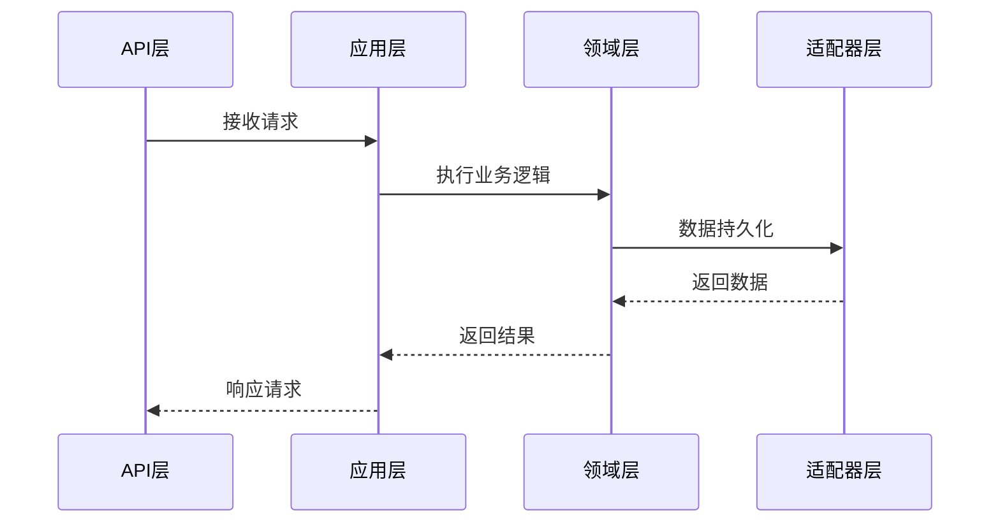

# Go Hexagonal 项目架构设计与实现深度解析

## 一、项目概述
本项目是基于六边形架构（Hexagonal Architecture）构建的Go语言服务框架，通过清晰的层次划分实现了业务逻辑与技术实现的解耦。项目主要功能包括：

1. 基础CRUD功能实现
2. 多数据库支持（MySQL/PostgreSQL/Redis）
3. 事件驱动架构
4. 完善的配置管理系统
5. 分层测试体系
6. 服务健康监控

## 二、架构设计解析

### 2.1 六边形架构实现


#### 核心层次划分：
```bash
.
├── domain        # 领域模型层
├── application   # 应用服务层
├── adapter       # 适配器层
└── api           # 接口层
```

### 2.2 核心模块交互流程


## 三、核心代码实现解析

### 3.1 服务启动流程（cmd/main.go）
```go
func main() {
    // 初始化配置
    config.Init("./config", "config")
    
    // 初始化存储库
    repository.Init(repository.WithMySQL())
    
    // 初始化服务
    service.Init(ctx)
    
    // 启动HTTP服务
    go http_server.Start(ctx, errChan, httpCloseCh)
    
    // 优雅关闭处理
    signal.Notify(sigChan, syscall.SIGINT, syscall.SIGTERM)
    // ... 关闭逻辑
}
```

关键点说明：
- 配置初始化优先于其他组件
- 存储库支持多数据库扩展
- 服务层依赖领域层实现
- 信号处理实现优雅关闭

### 3.2 工厂模式实现（application/factory.go）
```go
type UseCaseFactory struct {
    exampleService *service.ExampleService
    eventBus       event.EventBus
}

func (f *UseCaseFactory) CreateExampleUseCase() *example.CreateExampleUseCase {
    return example.NewCreateExampleUseCase(f.exampleService)
}
```

设计特点：
- 统一管理用例创建
- 依赖注入解耦
- 支持多事件总线实现

### 3.3 配置管理（config/config.go）
```go
type Config struct {
    Env          Env
    App          *AppConfig
    HTTPServer   *HttpServerConfig
    MySQL        *MySQLConfig
    // ... 其他配置
}

func Load(configPath string, configFile string) (*Config, error) {
    viper.SetConfigName(configFile)
    viper.AddConfigPath(configPath)
    // ... 配置加载逻辑
}
```

配置加载流程：
1. 读取YAML文件
2. 环境变量覆盖
3. 类型安全转换
4. 全局配置初始化

### 3.4 事件驱动实现（domain/event）
```go
// 事件发布
func (s *ExampleService) Create(ctx context.Context, example *model.Example) {
    // ... 业务逻辑
    evt := event.NewExampleCreatedEvent(createdExample.Id, createdExample.Name)
    s.EventBus.Publish(ctx, evt)
}

// 事件处理
type ExampleEventHandler struct{}
func (h *ExampleEventHandler) HandleEvent(ctx context.Context, event Event) error {
    switch event.EventName() {
    case ExampleCreatedEventName:
        // 处理创建事件
    case ExampleUpdatedEventName:
        // 处理更新事件
    }
}
```

事件总线特性：
- 内存总线（InMemoryEventBus）
- Kafka总线实现
- 多事件处理器支持
- 异步事件处理

## 四、关键设计模式应用

### 4.1 仓储模式实现
```go
// 领域层接口定义
type IExampleRepo interface {
    Create(ctx context.Context, tr Transaction, example *model.Example) (*model.Example, error)
    // ... 其他方法
}

// MySQL实现
type EntityExample struct {
    gorm.Model
    Name  string
    Alias string
}

func (e *EntityExample) Create(ctx context.Context, tr repo.Transaction, example *model.Example) {
    // GORM实现细节
}
```

优势分析：
- 数据库实现可替换
- 业务逻辑与持久化解耦
- 统一事务管理

### 4.2 CQRS模式实践
```go
// 查询用例
type GetExampleUseCase struct {
    handler core.UseCaseHandler
}

// 命令用例
type CreateExampleUseCase struct {
    handler core.UseCaseHandler
}
```

实现特点：
- 读写操作分离
- 独立优化路径
- 事件溯源支持

## 五、测试策略

### 5.1 测试金字塔结构
```bash
.
├── unit          # 单元测试 70%
├── integration   # 集成测试 20%
└── e2e           # 端到端测试 10%
```

### 5.2 测试容器应用
```go
func SetupPostgreSQL(t *testing.T) *config.PostgreSQLConfig {
    req := testcontainers.ContainerRequest{
        Image:        "postgres:latest",
        ExposedPorts: []string{"5432/tcp"},
        WaitingFor:   wait.ForLog("database system is ready"),
    }
    // ... 容器启动逻辑
}
```

优势：
- 真实数据库环境
- 测试隔离性
- 自动化环境准备

## 六、部署与监控

### 6.1 健康检查端点
```go
router.GET("/ping", func(c *gin.Context) {
    c.String(200, "pong")
})
```

### 6.2 性能监控
```go
func RegisterPprof(r *gin.Engine) {
    pprofGroup := r.Group("/debug/pprof")
    {
        pprofGroup.GET("/", gin.WrapF(pprof.Index))
        pprofGroup.GET("/heap", gin.WrapH(pprof.Handler("heap")))
    }
}
```

监控指标：
- CPU Profiling
- 内存分析
- Goroutine跟踪
- 阻塞分析

## 七、最佳实践总结

1. **领域驱动设计**：严格划分领域边界
```go
// 领域模型定义
type Example struct {
    ID        int
    Name      string
    Alias     string
    CreatedAt time.Time
}
```

2. **依赖倒置**：高层模块不依赖底层实现
```go
// 领域服务定义
type ExampleService struct {
    Repository repo.IExampleRepo  // 接口依赖
}
```

3. **单一职责**：每个用例独立实现
```go
type CreateExampleUseCase struct {
    handler core.UseCaseHandler
}
```

4. **开放封闭**：通过适配器扩展功能
```go
type KafkaEventBus struct {
    producer sarama.SyncProducer
}
```

5. **测试驱动**：分层测试保障质量
```go
func TestExampleService_Create(t *testing.T) {
    // 模拟依赖
    mockRepo := new(mockExampleRepo)
    mockRepo.On("Create").Return(&model.Example{}, nil)
    
    // 测试逻辑
    service := service.NewExampleService(mockRepo)
    // ... 断言验证
}
```

## 八、性能优化建议

1. **连接池配置**
```yaml
mysql:
  max_idle_conns: 50
  max_open_conns: 100
  max_life_time: "36000s"
```

2. **缓存策略**
```go
type ExampleCache struct {
    redis *redis.Client
}

func (c *ExampleCache) Get(ctx context.Context, id int) (*model.Example, error) {
    // Redis缓存实现
}
```

3. **批量处理优化**
```go
func BatchCreateExamples(ctx context.Context, examples []*model.Example) error {
    // 批量插入优化
}
```

4. **异步处理**
```go
func asyncProcess(event Event) {
    go func() {
        // 后台处理逻辑
    }()
}
```

## 九、项目演进路线

1. **服务网格集成**
   - Istio服务治理
   - 分布式追踪

2. **云原生支持**
   - Kubernetes部署
   - Helm Chart打包

3. **可观测性增强**
   - Prometheus指标
   - Grafana监控面板

4. **安全加固**
   - JWT认证
   - RBAC授权

## 十、总结

本项目的架构设计充分体现了六边形架构的优势，通过清晰的层次划分和严谨的依赖管理，实现了：

- 业务核心与技术细节解耦
- 快速替换基础设施
- 高可测试性
- 灵活扩展能力

代码实现中大量运用了现代软件工程实践，包括：
- 领域驱动设计
- 依赖注入
- 事件驱动架构
- 测试驱动开发

本项目已在GitHub开源[Go-Hexagonal](https://github.com/RanchoCooper/go-hexagonal)，欢迎社区贡献和改进建议。
